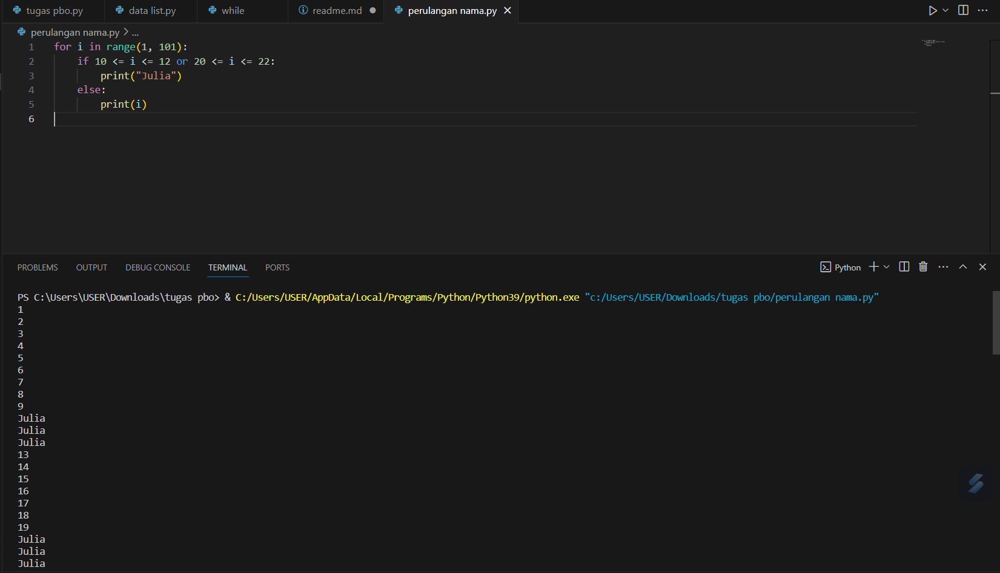
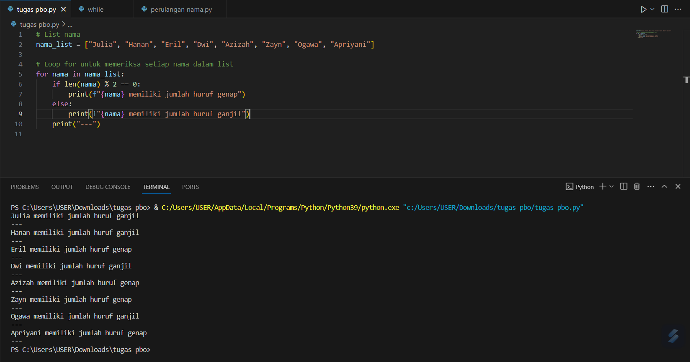
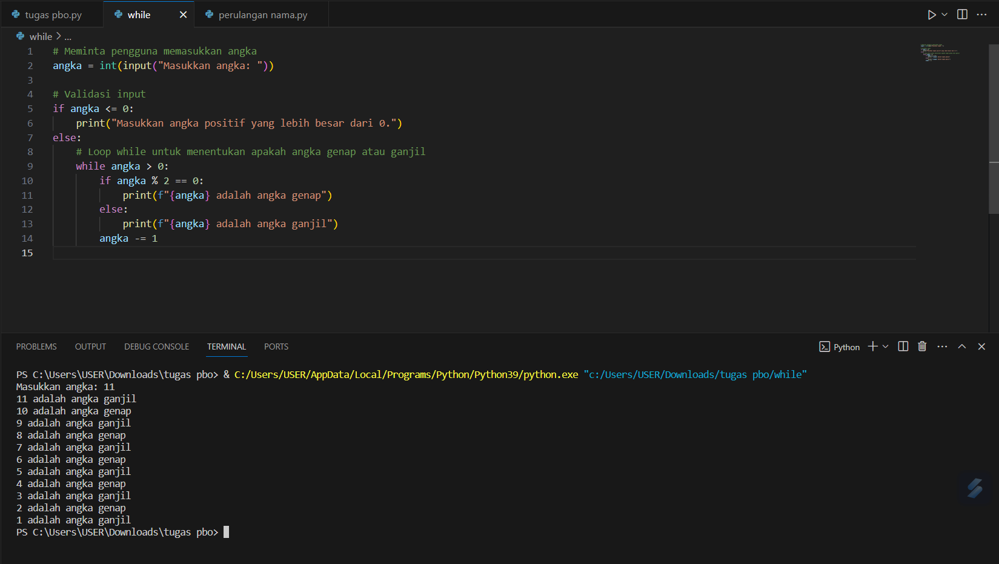
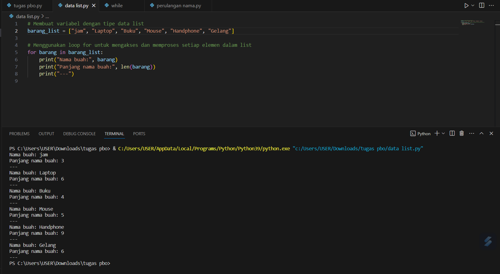

PERULANGAN MENGGUNAKAN PYTHON

### Project Overview

Terdapat dua jenis perualangan dalam bahasa pemrograman python, yaitu perulangan dengan for dan while.
Perulangan for disebut counted loop (perulangan yang terhitung), sementara perulangan while disebut uncounted loop (perulangan yang tak terhitung). Perbedaannya adalah perulangan for biasanya digunakan untuk mengulangi kode yang sudah diketahui banyak perulangannya. Sementara while untuk perulangan yang memiliki syarat dan tidak tentu berapa banyak perulangannya.

### Problem Statements

1. Buatlah perulangan hingga 100 menggunakan Python dengan output sebagai berikut:
   (https://github.com/randiijulian/randiijulian/assets/81604461/e32b6d92-7e3a-4323-a0e3-711009112c8e)

2. Buatlah program bebas, dengan menerapkan if else pada:
   a. For Loops  
   b. While Loops

3. Buatlah sebuah variabel dengan tipe data array, kemudian tampilkan semua nilai dalam variabel tersebut menggunakan perulangan for

- Tindak plagiasi tidak akan dinilai
- Buatlah penjelasan pada tiap section code yang telah dibuat pada file Readme.md di repository github, jelaskan mulai dari penggunaan code, input data & code saat dijalankan serta screenshot saat code dijalankan, tampilkan hasil dalam bentuk tabel jika diperlukan dan buatlah sebagus mungkin.

## Solution statements

1. Buatlah perulangan hingga 100 menggunakan Python

pada gambar diatas merupakan tampilan dari perulangan hingga 100 menggunakan python yang sesuai dengan contoh yang diberikan. for i in range(1, 101): Ini digunakan menginisialisasi perulangan for dengan variabel loop i yang akan mengambil nilai dari 1 hingga 100 (inklusif).
if 10 <= i <= 12 or 20 <= i <= 22:: Ini adalah kondisi if yang memeriksa apakah nilai i berada dalam rentang 10 hingga 12 atau 20 hingga 22. print("Julia"): Jika kondisi pada langkah kedua terpenuhi (nilai i berada dalam salah satu rentang tersebut), maka program akan mencetak "Julia". else: print(i): Jika kondisi pada langkah kedua tidak terpenuhi, maka program akan mencetak nilai i itu sendiri.

2. Buatlah program bebas, dengan menerapkan if else pada:
   a. For Loops  
   

pada gambar diatas merupakan penerpana if else pada for loops, dimana for loops adalah kondisional bahasa pemrograman yang digunakan untuk memeriksa kondisi tertentu.pada tampilan di atas menggunakan nama_list berisi beberapa nama orang.

for nama in nama_list: Inisiasi loop for yang akan mengambil setiap elemen (nama) dari list nama_list secara berurutan. if len(nama) % 2 == 0: Ini adalah kondisi if yang memeriksa apakah panjang (jumlah karakter) dari nama tersebut adalah bilangan genap. len(nama) mengembalikan jumlah karakter dalam string nama, dan % 2 == 0 mengecek apakah jumlah tersebut adalah bilangan genap.

print(f"{nama} memiliki jumlah huruf genap"): Jika kondisi pada langkah 3 terpenuhi (jumlah karakter genap), program akan mencetak pesan yang menyatakan bahwa nama tersebut memiliki jumlah huruf genap. else: print(f"{nama} memiliki jumlah huruf ganjil"): Jika kondisi pada langkah 3 tidak terpenuhi (jumlah karakter ganjil), program akan mencetak pesan yang menyatakan bahwa nama tersebut memiliki jumlah huruf ganjil. print("---"): Ini mencetak tanda garis sebagai pemisah antar setiap iterasi dalam loop for.

b. While Loops

pada gambar diatas merupakan tampilan dari while loops dengan menggunakan if else, meminta pengguna memasukkan angka, kemudian melakukan validasi dan mengeluarkan informasi apakah angka tersebut genap atau ganjil. angka = int(input("Masukkan angka: ")): Program meminta pengguna untuk memasukkan nilai angka dan menyimpannya dalam variabel angka. Fungsi input digunakan untuk mendapatkan input dari pengguna, dan int digunakan untuk mengonversi input menjadi bilangan bulat.

if angka <= 0: Ini adalah blok validasi. Jika angka yang dimasukkan kurang dari atau sama dengan 0, program akan mencetak pesan bahwa pengguna harus memasukkan angka positif yang lebih besar dari 0. else: Ini adalah blok yang akan dijalankan jika validasi pada langkah 2 tidak terpenuhi.

while angka > 0: Inisiasi loop while yang akan berlanjut selama nilai angka masih lebih besar dari 0. if angka % 2 == 0: Ini adalah kondisi di dalam loop yang memeriksa apakah angka adalah bilangan genap. Jika ya, program akan mencetak bahwa angka tersebut adalah angka genap.

else: Bagian ini akan dijalankan jika kondisi pada langkah 5 tidak terpenuhi, sehingga angka dianggap ganjil, dan program mencetak pesan bahwa angka tersebut adalah angka ganjil. angka -= 1: Ini mengurangkan nilai angka setiap kali iterasi dalam loop while, sehingga loop berakhir ketika angka kurang dari atau sama dengan 0.

3. Buatlah sebuah variabel dengan tipe data array, kemudian tampilkan semua nilai dalam variabel tersebut menggunakan perulangan for
   

pada gambar diatas merupakan tampilan dari variabel tipe data array yang menggunakan perulangan for. barang_list = ["jam", "Laptop", "Buku", "Mouse", "Handphone", "Gelang"]: Ini adalah pendefinisian variabel barang_list yang merupakan list yang berisi beberapa nama barang.

for barang in barang_list:: Inisiasi loop for yang akan mengambil setiap elemen (barang) dari list barang_list secara berurutan. print("Nama barang:", barang): Mencetak nama barang yang sedang diproses dalam iterasi saat ini.

print("Panjang nama barang:", len(barang)): Mencetak panjang (jumlah karakter) dari nama barang yang sedang diproses dalam iterasi saat ini menggunakan fungsi len().
print("---"): Mencetak tanda garis sebagai pemisah antar setiap iterasi dalam loop for.
Sebagai hasilnya, program akan mencetak nama dan panjang (jumlah karakter) dari setiap barang dalam list barang_list dan memisahkan setiap barang dengan tanda garis. Proses ini akan diulangi untuk setiap barang dalam list.

## Conclusion

for di Python adalah syntax yang digunakan untuk melakukan perulangan berdasarkan interval yang ditentukan pengguna. Perulangan for pada bahasa pemrograman Python mempunyai kelebihan yang tidak hanya berdasarkan range bilangan, juga termasuk perulangan terhadap item suatu urutan (list atau string). sedangkan while Perulangan while adalah salah satu tipe loop atau perulangan dalam Python yang memungkinkan kita menjalankan blok kode berulang kali selama kondisi yang ditentukan masih memenuhi.

## Daftar Pustaka

[1] Staff, R. (2023). Tutorial Python While Loop atau Perulangan While. Tutorial Python While Loop atau Perulangan While.  
[2] Muhardian, A. (2016). Belajar Pemrograman Python: Memahami Perulangan. Belajar Pemrograman Python: Memahami Perulangan.  
[3] dvernesia. (2017). for Python | Perulangan for pada Python dan Contohnya. for Python | Perulangan for pada Python dan Contohnya.
